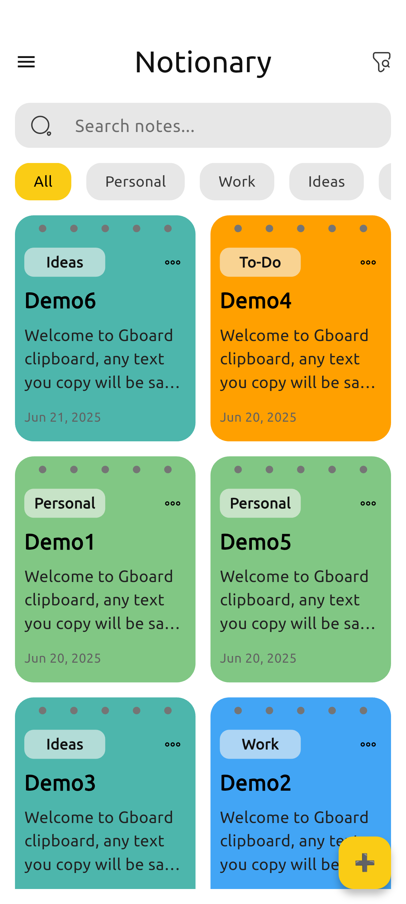
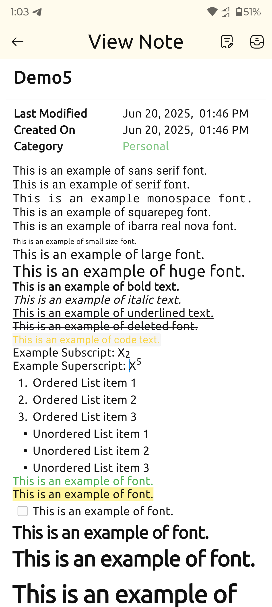
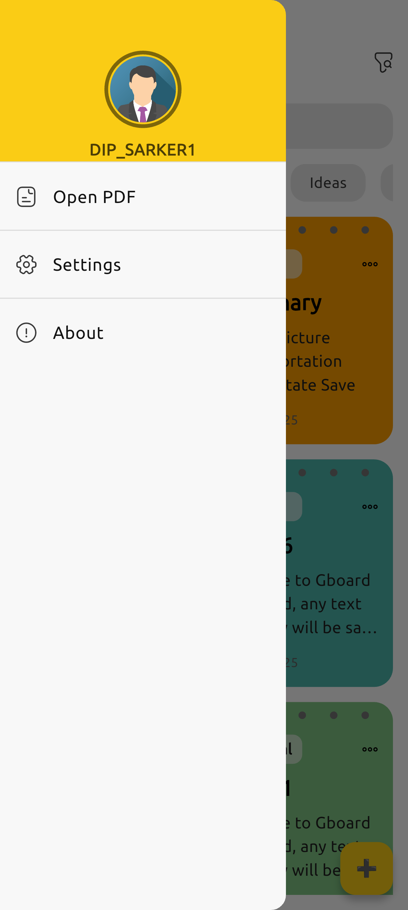
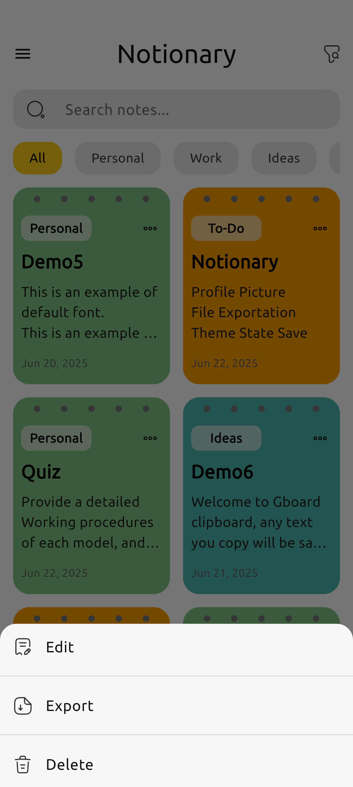
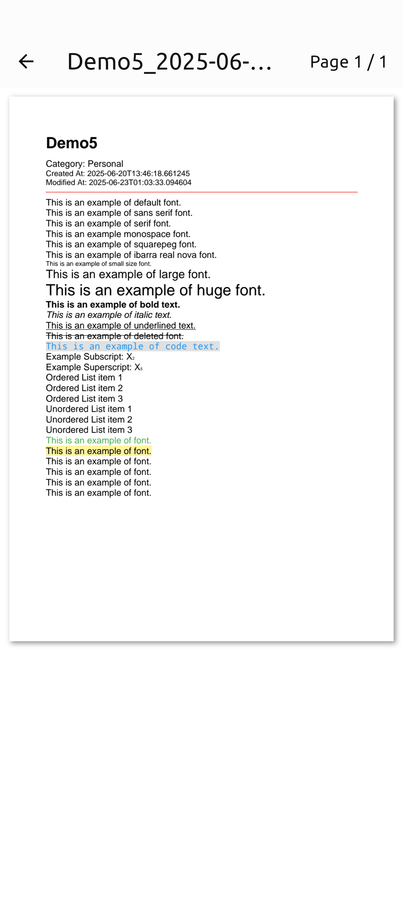
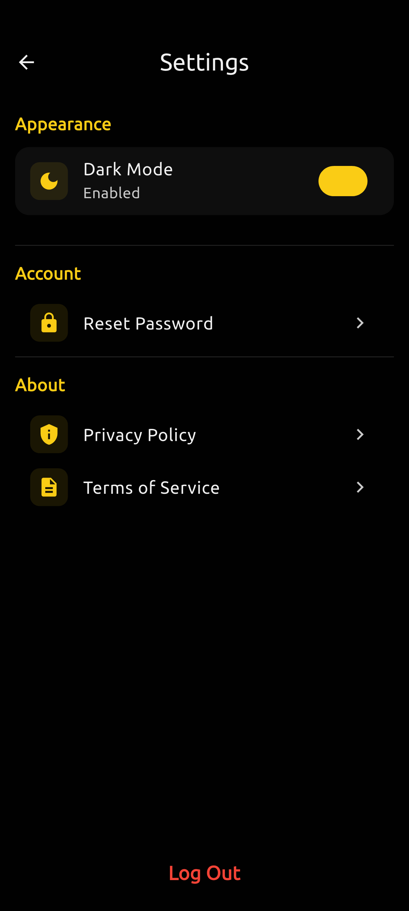
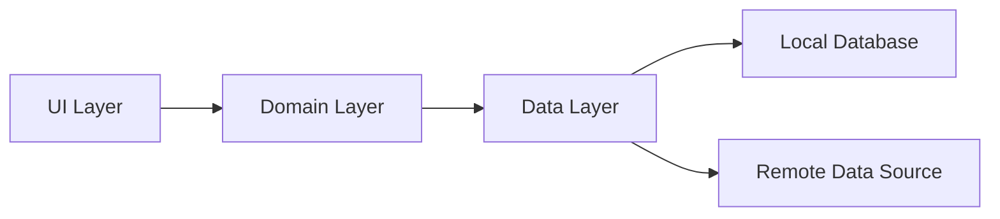

# Notionary - Elegant Notes for Android 📱✨

<div align="center">
  
  
  [](LICENSE)
  
  [](https://github.com/DIP-SARKER/Notionary/releases)
  

  **Capture ideas anywhere, organize thoughts effortlessly**
</div>


---

## 📱 Screenshots
| Home Screen | Note Editing | Menu | Features | Reading Mode | Dark Mode |
|-------------|--------------|------------|----------|----------|----------|
|  |  |  |  |  |  |

---

## 🚀 Key Features
- **🧠 Rich Note Editing** - Create and edit notes with rich formatting(Bold, italic, and so many) options to organize your thoughts beautifully.

- **🗂️ Category-based Smart Organization** - Easily sort and filter your notes using categories for a more structured note-taking experience.

- **🌗 Dark Mode Support** - A sleek, eye-friendly dark theme for comfortable usage in low-light environments.

- **🔍 Smart Instant Search** - Quickly find notes using an intuitive search feature that works in real time.

- **📋 Interactive UI** - A fluid and modern user interface designed for speed and usability, with SVG support and subtle animations.

- **🧩 Social Sign-In Integration** - Seamlessly sign in with a social media account and stay synced across devices.

- **🧑‍💻 Markdown Support** - Elevate your note-taking with full Markdown syntax support designed with technical persons in mind.

---

## 🚀 Installation
Download the latest APK from [Releases Section](https://github.com/yourusername/Notionary/releases)

**Requirements:**
- Android 8.0 (Oreo) or higher
- 50MB free storage

---

## 🛠️ Built With
- **Dart** - The core programming language powering the application logic.
- **Flutter** -  Cross-platform UI toolkit for building natively compiled mobile, web, and desktop applications from a single codebase.
- **Room Database** - Local storage solution
- **Material Design 3** - Clean, modern UI components aligned with Google's design system.
- **Provider** -  Lightweight state management solution for scalable and reactive UI updates.
- **SharedPreferences** -  Local storage solutions for fast key-value data management.
- **Firebase** -  Utilized for authentication and crash reporting.

---

## 🧩 Architecture


---

## 🌈 Contributing
We love contributions! Please follow these steps:
1. Fork the project
2. Create your feature branch (`git checkout -b feature/AmazingFeature`)
3. Commit your changes (`git commit -m 'Add some AmazingFeature'`)
4. Push to the branch (`git push origin feature/AmazingFeature`)
5. Open a Pull Request

---

## 📜 License
```text
Copyright 2025 DIP SARKER

Licensed under the Apache License, Version 2.0 (the "License");
you may not use this file except in compliance with the License.
You may obtain a copy of the License at

   http://www.apache.org/licenses/LICENSE-2.0

Unless required by applicable law or agreed to in writing, software
distributed under the License is distributed on an "AS IS" BASIS,
WITHOUT WARRANTIES OR CONDITIONS OF ANY KIND, either express or implied.
See the License for the specific language governing permissions and
limitations under the License.
```

---

## 📬 Contact
Have questions or suggestions? We'd love to hear from you!

- **Email**: contact.dipsdevs@gmail.com
- **Website**: [Portfolio](https://dip-sarker.github.io/DIP_SARKER/)

---

<div align="center">
  <h3>💖 Support Notionary</h3>
  <p>If you enjoy using Notionary, consider supporting development:</p>
  
  [](https://buymeacoffee.com/dip_sarker)
  [](https://github.com/sponsors/DIP-SARKER)
  
  <sub>Made with ❤️ for organized minds everywhere</sub>
</div>
